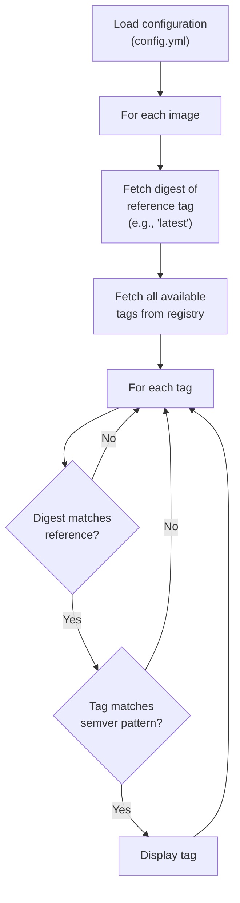

# Gocker

A tool to check Docker image tag versions across multiple repositories to make it easy to update digests.

Gocker retrieves Docker image information from Docker Hub and displays tags matching the specified reference tag's digest, filtering to only semver formats (`1.0.0`, `v2.1`, `3`...).

Currently works with Docker Hub only (but not for long).

## Configuration

`config.yml`

```yaml
tag: latest
images:
  - namespace: library
    image: traefik
  - namespace: library
    image: postgres
```

## Usage

```bash
go run main.go
```

## Output

```
*** library/traefik ***
Digest: sha256:9c2a54d87f76f5c2f5f2682c68394af92fb12c0a2686798d6462a3f84bd78eaf
Pushed: 0 days ago
v3.7.12
v3.7
v3
3.7.12
3.7
3

*** library/postgres ***
Digest: sha256:4ef4dbc939d61acea57712655ddb4b4ab27419c913f94cca0cd57cb3ea3c2280
Pushed: 2 days ago
18.6
18
```

For each configured image, gocker displays:
- Digest of the tag specified in the configuration
- Days since the image was last pushed
- List of tags matching semantic versioning format

## Algorithm




https://ghcr.io/v2/amir20/dozzle/manifests/latest 
application/vnd.oci.image.index.v1+json
Get latest digest

https://ghcr.io/v2/amir20/dozzle/tags/list
Get tag list and only tag

https://api.github.com/users/amir20/packages/container/dozzle/versions
application/vnd.github+json
Get digest list and date

https://api.github.com/users/amir20/packages/container/dozzle/versions/1203301179
application/vnd.github+json
Get info from one package